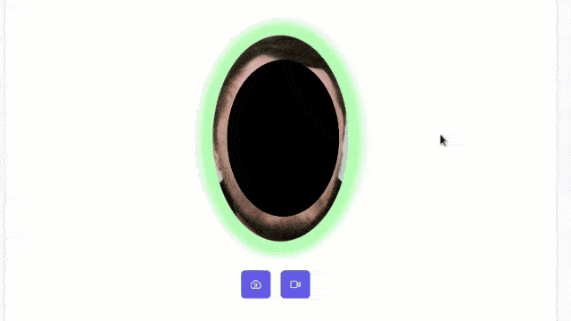

[](https://opensource.org/licenses/MIT)

# Face Detect
> Determines whether the oval of the face is located in a given ellipse.



## Based On

- [Face-API.JS](https://github.com/justadudewhohacks/face-api.js)
- [Vue 3](https://github.com/vuejs/vue)
- [PrimeVue](https://github.com/primefaces/primevue)
- [Sakai](https://github.com/primefaces/sakai-vue)

## Features
- Get Snapshot
- Get Video Record

## Specification
> When testing, used a Sunplus-IT-Co-HD-720P-webcam with a resolution of 1280x640. Other camera resolutions require code optimization.

## Customize Configuration

See [Vite Configuration Reference](https://vitejs.dev/config/).

## Project Setup

```sh
npm install
```

### Compile and Hot-Reload for Development

```sh
npm run dev
```

### Compile and Minify for Production

```sh
npm run build
```

### Lint with [ESLint](https://eslint.org/)

```sh
npm run lint
```
